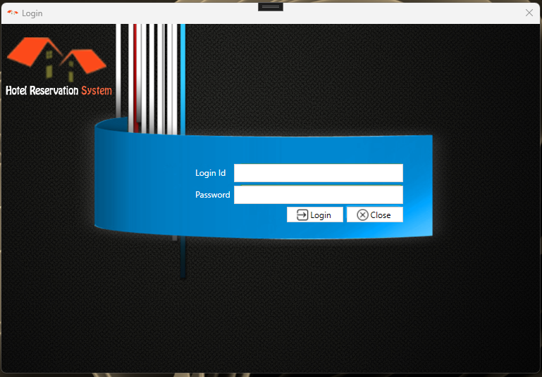
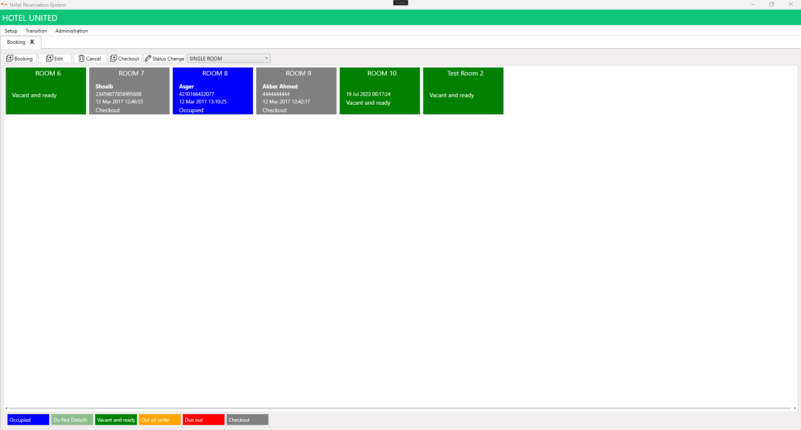
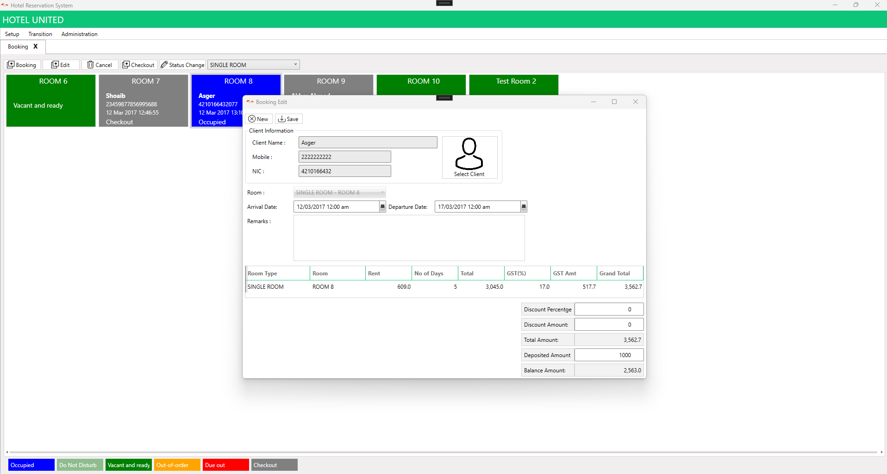
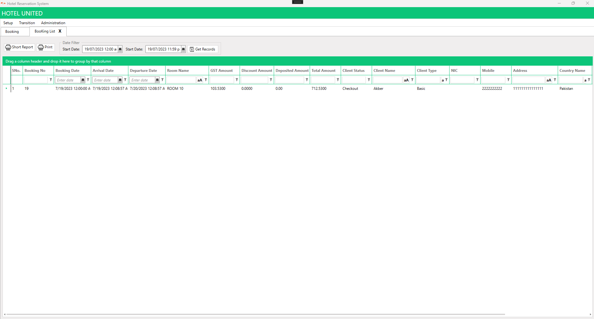
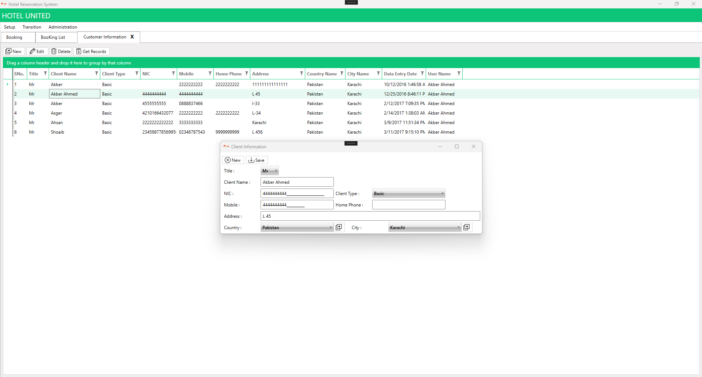
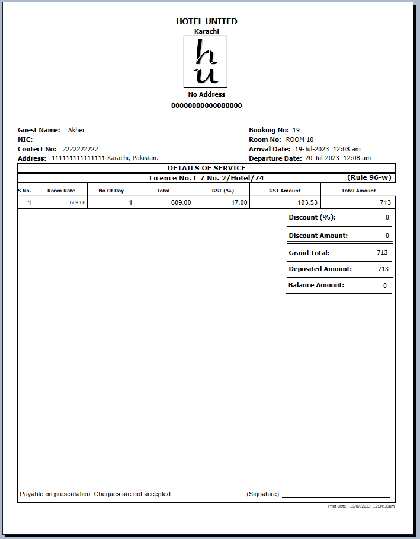

# Hotel Reservation System

The Hotel Reservation System Software Repository is a collection of software tools and resources designed to facilitate hotel management and streamline the reservation process. It offers a comprehensive set of solutions to automate various aspects of hotel operations, including room bookings, guest management, inventory control, billing, and more.

####  Key Features:
- **Guest Management: ** Maintain a centralized database of guest information, including contact details, preferences, and stay history, to personalize the guest experience and foster customer loyalty.

- **Reservation Management:** Efficiently manage reservations, including modifications, cancellations, and room upgrades, ensuring accurate and up-to-date information.

- **Billing and Invoicing**: Automate billing processes, generate invoices, track payments, and integrate with accounting systems to streamline financial management.

- **Reporting and Analytics:** Generate comprehensive reports on occupancy rates, revenue, guest preferences, and other key performance indicators to inform strategic decision-making.

## Screenshot

